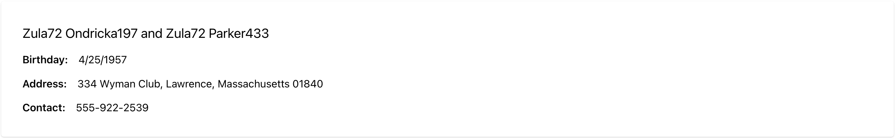

# Display FHIR data

## Key concepts

BonFHIR provides many useful features for fetching and formatting FHIR data, with built-in Typescript support for FHIR resources and data types.

- `useFhirRead()` will return a query that fetches a specific FHIR resource by ID or by a Reference.

- `<FhirValue />` is a BonFHIR component that will automatically format a value based on the FHIR data type of the value, such as HumanName, date, Address, and more. [More details in storybook](https://bonfhir.dev/storybook/?path=/docs/bonfhir-data-display-fhirvalue--docs)

- `<FhirQueryLoader />` can be used with `useFhirRead` to simplify loading and error handling. [More details in storybook](https://bonfhir.dev/storybook/?path=/docs/bonfhir-feedback-fhirqueryloader--docs)

## Step by step

This guide builds off of the previous guide: [Setup Medplum](/docs/build-a-fhir-app-with-react/setup-medplum).

Let's start by retrieving a Patient and displaying some information about them.

1. Select a Patient in Medplum to retrieve. Open the Patient table (http://localhost:8100/Patient) and view a patient's details. Take note of the ID as we will use this to query.

2. In the newly created Vite app, open `src/pages/Home.tsx`

3. To fetch a Patient with `useFhirRead`, indicate that the type is `"Patient"` and the ID is what you copied in step 1. For example: `"afb2bbf9-872c-47a9-9b31-2a737ed65f0b"`

   ```tsx
   const patientQuery = useFhirRead(
     "Patient",
     "afb2bbf9-872c-47a9-9b31-2a737ed65f0b",
   );
   ```

4. Display the patient's name with `<FhirValue />` where the type is `"HumanName"`

   ```tsx
   <FhirValue type="HumanName" value={patientQuery.data?.name} />
   ```

5. Wrap the value inside the `<FhirQueryLoader />` and pass `patient` directly into the value component. The query loader will handle loading and error states with automatic retries. To preview this functionality, replace the patient ID with a value that does not exist in the database.

   ```tsx
   return (
      <FhirQueryLoader query={patientQuery}>
         {(patient) => (
            <FhirValue type="HumanName" value={patient.name} />
         )}
      <FhirQueryLoader />
   );
   ```

6. BonFHIR components render using [Mantine](https://mantine.dev/) components - so you can mix & match with all Mantine components for layout and data presentation. We can now add additional information about the patient including their birthday, addresses and contact points. `FhirValue` will take care of all data formatting for us. Don't hesitate to play with options as well to explore formatting capabilities.

   ```tsx
   <Group>
      <Text fw={600}>Birthday: </Text>
      <FhirValue type="date" value={patient.birthDate} options={{ dateStyle: "full" }} />
   </Group>
   <Group>
      <Text fw={600}>Address: </Text>
      <FhirValue type="Address" value={patient.address} />
   </Group>
   <Group>
      <Text fw={600}>Contact: </Text>
      <FhirValue type="ContactPoint" value={patient.telecom} />
   </Group>
   ```

## Final result

Here is the output of this example with patient information displayed on a single card:



```tsx title="src/pages/Home.tsx"
import { useFhirRead } from "@bonfhir/query/r4b";
import { FhirQueryLoader, FhirValue } from "@bonfhir/react/r4b";
import { Group, Paper, Stack, Text } from "@mantine/core";

export default function Home() {
  const patientQuery = useFhirRead(
    "Patient",
    "afb2bbf9-872c-47a9-9b31-2a737ed65f0b",
  );

  return (
    <Paper p="xl">
      <Paper shadow="xs" p="xl">
        <FhirQueryLoader query={patientQuery}>
          {(patient) => (
            <Stack gap="sm">
              <Text size="xl">
                <FhirValue type="HumanName" value={patient.name} />
              </Text>
              <Group>
                <Text fw={600}>Birthday: </Text>
                <FhirValue type="date" value={patient.birthDate} />
              </Group>
              <Group>
                <Text fw={600}>Address: </Text>
                <FhirValue type="Address" value={patient.address} />
              </Group>
              <Group>
                <Text fw={600}>Contact: </Text>
                <FhirValue type="ContactPoint" value={patient.telecom} />
              </Group>
            </Stack>
          )}
        </FhirQueryLoader>
      </Paper>
    </Paper>
  );
}
```
