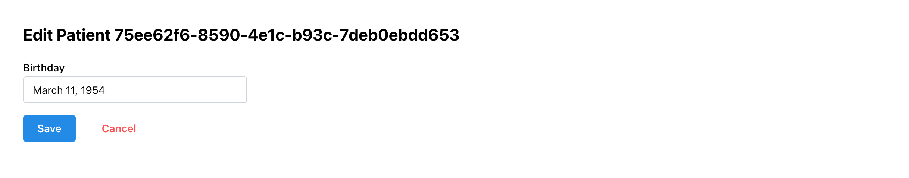
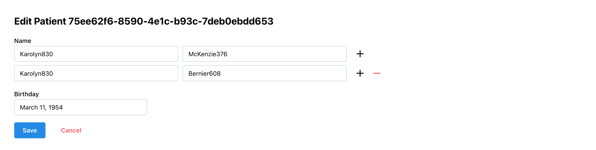

Let's learn how to create or edit FHIR resources through forms.

## Key concepts

- Create a new page and adapt the navigation / router
- [`useFhirResourceForm`](/packages/react/mantine/use-fhir-resource-form) to create a controlled form to edit FHIR resources
- [`<FhirInput>`](/packages/react/components/fhir-input) to create form inputs for FHIR data types
- [`<FhirInputArray>`](/packages/react/components/fhir-input-array) for repeating elements in resources

## Step by step

Let's start by creating a new page and adapt navigation.

1.  Create a new page called `EditPatient.tsx` that expect a patient ID in the url:

    ```tsx title="src/pages/EditPatient.tsx"
    import { Title } from "@mantine/core";
    import { useParams } from "react-router-dom";

    export default function EditPatient() {
      const { patientId } = useParams();

      return <Title order={3}>Edit Patient {patientId}</Title>;
    }
    ```

    This page does not do much at the moment, but it will be used to validate the navigation.

2.  Add the page to the router by editing the `index.tsx` file - this allows us to create a path for it:

    ```tsx title="src/index.tsx"
    import EditPatient from "./pages/EditPatient.tsx";
    import Home from "./pages/Home.tsx";

    const router = createBrowserRouter([
      {
        path: "/",
        element: <App />,
        children: [
          {
            index: true,
            element: <Home />,
          },
          {
            path: "/patients/:patientId",
            element: <EditPatient />,
          },
        ],
      },
    ]);

    //...
    ```

3.  Add a link to navigate to this page from the home page:

    ```tsx title="src/pages/Home.tsx"
    import { Button } from "@mantine/core";
    import { Link } from "react-router-dom";

    <Button component={Link} to={`/patients/${patient.id}`}>
      Edit
    </Button>;
    ```

    When clicking on the "Edit" button now, we can see that we navigate to our new page!

4.  Edit the `EditPatient.tsx` page to create a form to edit the patient `birthDate`:

    ```tsx title="src/pages/EditPatient.tsx"
    import { useFhirResourceForm } from "@bonfhir/mantine/r4b";
    import { FhirInput } from "@bonfhir/react/r4b";
    import { Button, Group, Paper, Stack, Title } from "@mantine/core";
    import { useNavigate, useParams } from "react-router-dom";

    export default function EditPatient() {
      const { patientId } = useParams();
      const navigate = useNavigate();

      const form = useFhirResourceForm({
        id: patientId,
        type: "Patient",
        mutationOptions: {
          onError(error) {
            alert(JSON.stringify(error, null, 2));
          },
          onSuccess() {
            navigate(-1);
          },
        },
      });

      return (
        <Paper p="xl">
          <form onSubmit={form.onSubmit}>
            <Stack>
              <Title order={3}>Edit Patient {form.form.values?.id}</Title>
              <Group w={300}>
                <FhirInput
                  type="date"
                  label="Birthday"
                  {...form.getInputProps(`birthDate`)}
                />
              </Group>
              <Group>
                <Button type="submit">Save</Button>
                <Button
                  variant="subtle"
                  color="red"
                  onClick={() => navigate(-1)}
                >
                  Cancel
                </Button>
              </Group>
            </Stack>
          </form>
        </Paper>
      );
    }
    ```

    Here you can see a couple of constructs:

        - `useFhirResourceForm` is a hook that manages the complete life-cycle of retrieving a FHIR resource and submitting
          it for change or creation; you just have to specify the resource type and id, or `new` for id to create a new resource;
          the resulting variable can be spread out to the form's input to apply the forms binding;
          this follows the mode of operation of [Mantine's `useForm` hook](https://mantine.dev/form/use-form/)
          IF you need more control over the loading and submission of forms, there is an alternative `useFhirForm` hook
          that only handle form control, without interaction with the FHIR API
        - `<FhirInput>` as a mirror to `<FhirValue>` to create inputs for FHIR data types - in this case `date`
        - hook-up navigation on cancellation or success of the submission; `-1` simply makes it go back to the previous page

    Simply update the birth date of the patient, and observe the resource being updated back in the home page.

    

    Notice how we did not need to do anything to refresh the data in the home page; the `@bonfhir/query` package takes
    care of cache invalidation and refresh for us.

    :::warning[FHIR validation error on synthea resources]

    You may get a validation error if you use a patient from the synthea import (loaded using the `npm run add-sample-data` command).  
    Some of these resources have invalid data schemas that might failed when they are updated.

    If this is the case, either pick a different patient, manually edit the patient in Medplum and remove the extensions,
    or you can simply strip their extensions by applying a transformation to the data prior to it being submitted:

    ```tsx
    const form = useFhirResourceForm({
      id: patientId,
      type: "Patient",
      formOptions: {
        transformValues(patient) {
          // This remove the extension field from the patient object
          const { extension, ...rest } = patient;
          return rest;
        },
      },
      mutationOptions: {
        onError(error) {
          alert(JSON.stringify(error, null, 2));
        },
        onSuccess() {
          navigate(-1);
        },
      },
    });
    ```

    :::

5.  Add another input to manipulate patient names:

    ```tsx title="src/pages/EditPatient.tsx"
    <Group w="50%">
      <FhirInputArray
        label="Name"
        min={1}
        max={5}
        {...form.getArrayInputProps(`name`, { newValue: {} })}
      >
        {({ index }) => (
          <FhirInput
            type="HumanName"
            mode="simple"
            {...form.getInputProps(`name.${index}`)}
          />
        )}
      </FhirInputArray>
    </Group>
    ```

    Notice the usage of `<FhirInputArray>` in conjunction with `form.getArrayInputProps` to handle repeating elements
    in a FHIR resource.

    

:::info[Works in creation too]

If you navigate to this page using `new` for the patientId value (http://localhost:5173/patients/new),
you will be presented with a form that can create a new patient. Go ahead and try it!  
Then head over to http://localhost:8100/Patient to see your newly created patient!

:::

## Final result

```tsx title="src/index.tsx"
import React from "react";
import ReactDOM from "react-dom/client";
import { RouterProvider, createBrowserRouter } from "react-router-dom";
import App from "./App.tsx";
import EditPatient from "./pages/EditPatient.tsx";
import Home from "./pages/Home.tsx";

const router = createBrowserRouter([
  {
    path: "/",
    element: <App />,
    children: [
      {
        index: true,
        element: <Home />,
      },
      {
        path: "/patients/:patientId",
        element: <EditPatient />,
      },
    ],
  },
]);

ReactDOM.createRoot(document.getElementById("root")!).render(
  <React.StrictMode>
    <RouterProvider router={router} />
  </React.StrictMode>,
);
```

```tsx title="src/pages/Home.tsx"
import { useFhirRead } from "@bonfhir/query/r4b";
import { FhirQueryLoader, FhirValue } from "@bonfhir/react/r4b";
import { Button, Group, Paper, Stack, Text } from "@mantine/core";
import { Link } from "react-router-dom";
import PatientReportsTable from "../components/PatientReportsTable";

export default function Home() {
  const patientQuery = useFhirRead(
    "Patient",
    "afb2bbf9-872c-47a9-9b31-2a737ed65f0b",
  );

  return (
    <FhirQueryLoader query={patientQuery}>
      {(patient) => (
        <Paper p="xl">
          <Paper shadow="xs" p="xl">
            <Stack gap="sm">
              <Text size="xl">
                <FhirValue type="HumanName" value={patient.name} />
              </Text>
              <Group>
                <Text fw={600}>Birthday: </Text>
                <FhirValue type="date" value={patient.birthDate} />
              </Group>
              <Group>
                <Text fw={600}>Address: </Text>
                <FhirValue type="Address" value={patient.address} />
              </Group>
              <Group>
                <Text fw={600}>Contact: </Text>
                <FhirValue type="ContactPoint" value={patient.telecom} />
              </Group>
              <Group>
                <Button component={Link} to={`/patients/${patient.id}`}>
                  Edit
                </Button>
              </Group>
            </Stack>
          </Paper>
          <br />
          <PatientReportsTable patientId={patient.id} />
        </Paper>
      )}
    </FhirQueryLoader>
  );
}
```

```tsx title="src/pages/EditPatient.tsx"
import { useFhirResourceForm } from "@bonfhir/mantine/r4b";
import { FhirInput, FhirInputArray } from "@bonfhir/react/r4b";
import { Button, Group, Paper, Stack, Title } from "@mantine/core";
import { useNavigate, useParams } from "react-router-dom";

export default function EditPatient() {
  const { patientId } = useParams();
  const navigate = useNavigate();

  const form = useFhirResourceForm({
    id: patientId,
    type: "Patient",
    mutationOptions: {
      onError(error) {
        alert(JSON.stringify(error, null, 2));
      },
      onSuccess() {
        navigate(-1);
      },
    },
  });

  return (
    <Paper p="xl">
      <form onSubmit={form.onSubmit}>
        <Stack>
          <Title order={3}>Edit Patient {form.form.values?.id}</Title>
          <Group w="50%">
            <FhirInputArray
              label="Name"
              min={1}
              max={5}
              {...form.getArrayInputProps(`name`, { newValue: {} })}
            >
              {({ index }) => (
                <FhirInput
                  type="HumanName"
                  mode="simple"
                  {...form.getInputProps(`name.${index}`)}
                />
              )}
            </FhirInputArray>
          </Group>
          <Group w={300}>
            <FhirInput
              type="date"
              label="Birthday"
              {...form.getInputProps(`birthDate`)}
            />
          </Group>
          <Group>
            <Button type="submit">Save</Button>
            <Button variant="subtle" color="red" onClick={() => navigate(-1)}>
              Cancel
            </Button>
          </Group>
        </Stack>
      </form>
    </Paper>
  );
}
```

## Bonus points

It is always nice to notify users of the success of an operation.  
We can use [Mantine Notification system](https://mantine.dev/x/notifications/) for that.

1. Stop the dev server (Ctrl+C) and add the package:

   ```bash npm2yarn
   npm install @mantine/notifications
   ```

2. Add the CSS and provider in the `App.tsx` file:

   ```tsx title="src/App.tsx"
   import "@mantine/notifications/styles.css";
   import { Notifications } from '@mantine/notifications';

   export default function App() {
      const navigate = useNavigate();
      return (
        <MantineProvider theme={theme}>
          <Notifications />
          //...
   ```

3. Hook up to the mutation success to inform the user:

   ```tsx title="src/pages/EditPatient.tsx"
   import { notifications } from "@mantine/notifications";

   export default function EditPatient() {
    const { patientId } = useParams();
    const navigate = useNavigate();
    const { formatter } = useFhirUIContext();

    const form = useFhirResourceForm({
      id: patientId,
      type: "Patient",
      mutationOptions: {
        onError(error) {
          alert(JSON.stringify(error, null, 2));
        },
        onSuccess(patient) {
          notifications.show({
            message: `Saved patient ${formatter.format(
              "HumanName",
              patient.name,
              { max: 1 },
            )}`,
            color: "green",
          });
          navigate(-1);
        },
      },
    });
   ```
