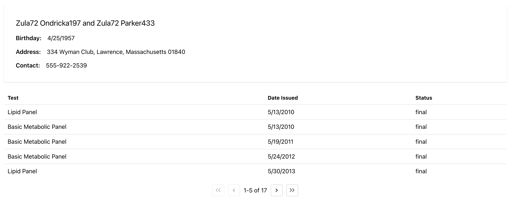

# Create a table with pagination

## Key concepts

- `useFhirSearch()` will return a query that fetches data for a type of FHIR resource. It also accepts search parameters that can either be a function or a search parameters string.
- `<FhirTable />` a BonFHIR component that displays FHIR data in a table. Each column can be customized with built-in support for sorting and pagination. [More details in storybook](https://bonfhir.dev/storybook/?path=/docs/bonfhir-data-display-fhirtable--docs)
- `useFhirSearchController()`: setup and manage FHIR search functionality through a simple interface
- `<FhirPagination />`: a BonFHIR component that controls FhirTable pagination via the search controller [More details in storybook](https://bonfhir.dev/storybook/?path=/docs/bonfhir-navigation-fhirpagination--docs)

## Step by step

This guide builds off of the previous guide: [Display FHIR data](/docs/build-a-fhir-app-with-react/display-fhir-data).

1. Create a new React component called `PatientReportsTable` that receives a patient ID as a prop. Import this component in `pages/Home.tsx` and add the table component inside the page, passing in `patient.id`.

   ```tsx title="src/components/PatientDiagnosticReportsTable.tsx"
   import { FC, ReactElement } from "react";

   type PatientReportsTableProps = {
     patientId: string;
   };

   const PatientReportsTable: FC<PatientReportsTableProps> = ({
     patientId,
   }): ReactElement => {
     return (
       <div>
         <p>{patientId}</p>
       </div>
     );
   };

   export default PatientReportsTable;
   ```

   ```tsx title="src/pages/Home.tsx"
   <PatientReportsTable patientId={patient.id} />
   ```

2. Create the search query with `useFhirSearch` for the `"DiagnosticReport"` resource type. BonFHIR has built-in type support for FHIR resource content, so the official [HL7 FHIR documentation](https://build.fhir.org/diagnosticreport.html#resource) can be used to understand what search parameters are available.

   For this example, the search function will search for resources where the subject is a patient with the value of the patientId prop. The search function also indicates that the data should be sorted by property `issued` with `-` prefix to sort in reverse.

   ```tsx
   const diagnosticReportsQuery = useFhirSearch("DiagnosticReport", (search) =>
     search.patient(patientId)._sort("-issued"),
   );
   ```

3. Inside a FhirQueryLoader, setup the FhirTable. The first parameter will be the expanded query. Each column of the table should be configured with:

   - `key`: the name of the resource property
   - `title`: the column header
   - `render`: a function that receives the individual resource and prepares the value. The `FhirValue` component can be used here to simplify formatting.

   In this example, we will display the Diagnostic Report code, date issued and status.

   ```tsx
   <FhirQueryLoader query={diagnosticReportsQuery}>
     <FhirTable
       {...diagnosticReportsQuery}
       columns={[
         {
           key: "code",
           title: "Test",
           render: (diagnosticReport) => (
             <FhirValue type="CodeableConcept" value={diagnosticReport.code} />
           ),
         },
         {
           key: "issued",
           title: "Date Issued",
           render: (diagnosticReport) => (
             <FhirValue type="date" value={diagnosticReport.issued} />
           ),
         },
         {
           key: "status",
           title: "Status",
           render: (diagnosticReport) => (
             <FhirValue type="string" value={diagnosticReport.status} />
           ),
         },
       ]}
     />
   </FhirQueryLoader>
   ```

4. To add pagination, define a search controller with `useFhirSearchController` above the query. The search controller manages sorting and paginating FHIR resources. Initialize the search controller with the sort order for the corresponding resource type, as well as a page size.

   ```tsx
   const searchController = useFhirSearchController<DiagnosticReportSortOrder>({
     pageSize: 5,
   });
   ```

   Update the query `search` function with `_count(searchController.pageSize)` and `_total("accurate")` to indicate how many resources to retrieve and the total number of resources that are available. Finally, include a third argument the `searchController.pageUrl`, which is how the query knows which page of resources to fetch.

   ```tsx
   const diagnosticReportsQuery = useFhirSearch(
     "DiagnosticReport",
     (search) =>
       search
         .patient(patientId)
         ._sort("issued")
         ._count(searchController.pageSize)
         ._total("accurate"),
     searchController.pageUrl,
   );
   ```

5. Connect the search controller to the `FhirTable` by including it as a prop.

   ```tsx
     <FhirTable
       {...diagnosticReportsQuery}
       {...searchController}
   ```

   Insert the `FhirPagination` component below the table.

   ```tsx
   <FhirPagination {...diagnosticReportsQuery} {...searchController} />
   ```

## Final result

Here is the output of this example with a paginated table of Diagnostic Reports for the patient!



```tsx title="src/components/PatientReportsTable.tsx"
import { DiagnosticReportSortOrder } from "@bonfhir/core/r4b";
import { useFhirSearch } from "@bonfhir/query/r4b";
import {
  FhirPagination,
  FhirQueryLoader,
  FhirTable,
  FhirValue,
  useFhirSearchController,
} from "@bonfhir/react/r4b";
import { FC, ReactElement } from "react";

type PatientReportsTableProps = {
  patientId: string;
};

const PatientReportsTable: FC<PatientReportsTableProps> = ({
  patientId,
}): ReactElement => {
  const searchController = useFhirSearchController<DiagnosticReportSortOrder>({
    pageSize: 5,
  });

  const diagnosticReportsQuery = useFhirSearch(
    "DiagnosticReport",
    (search) =>
      search
        .patient(patientId)
        ._sort("issued")
        ._count(searchController.pageSize)
        ._total("accurate"),
    searchController.pageUrl,
  );

  return (
    <FhirQueryLoader query={diagnosticReportsQuery}>
      <FhirTable
        {...diagnosticReportsQuery}
        {...searchController}
        columns={[
          {
            key: "code",
            title: "Test",
            render: (diagnosticReport) => (
              <FhirValue type="CodeableConcept" value={diagnosticReport.code} />
            ),
          },
          {
            key: "issued",
            title: "Date Issued",
            render: (diagnosticReport) => (
              <FhirValue type="date" value={diagnosticReport.issued} />
            ),
          },
          {
            key: "status",
            title: "Status",
            render: (diagnosticReport) => (
              <FhirValue type="string" value={diagnosticReport.status} />
            ),
          },
        ]}
      />
      <FhirPagination {...diagnosticReportsQuery} {...searchController} />
    </FhirQueryLoader>
  );
};

export default PatientReportsTable;
```

```tsx title="src/pages/Home.tsx"
import { useFhirRead } from "@bonfhir/query/r4b";
import { FhirQueryLoader, FhirValue } from "@bonfhir/react/r4b";
import { Group, Paper, Stack, Text } from "@mantine/core";
import PatientReportsTable from "../components/PatientReportsTable";

export default function Home() {
  const patientId = "afb2bbf9-872c-47a9-9b31-2a737ed65f0b";

  const patientQuery = useFhirRead("Patient", patientId);

  return (
    <FhirQueryLoader query={patientQuery}>
      {(patient) => (
        <Paper p="xl">
          <Paper shadow="xs" p="xl">
            <Stack gap="sm">
              <Text size="xl">
                <FhirValue type="HumanName" value={patient.name} />
              </Text>
              <Group>
                <Text fw={600}>Birthday: </Text>
                <FhirValue type="date" value={patient.birthDate} />
              </Group>
              <Group>
                <Text fw={600}>Address: </Text>
                <FhirValue type="Address" value={patient.address} />
              </Group>
              <Group>
                <Text fw={600}>Contact: </Text>
                <FhirValue type="ContactPoint" value={patient.telecom} />
              </Group>
            </Stack>
          </Paper>
          <br />
          <PatientReportsTable patientId={patient.id} />
        </Paper>
      )}
    </FhirQueryLoader>
  );
}
```
