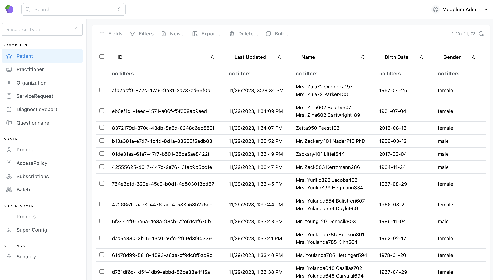

BonFHIR can connect to any FHIR-based API. For local development, BonFHIR provides an easy setup and connect experience with [Medplum](https://www.medplum.com/) as a backend.

1. Install and start [Docker](https://docs.docker.com/desktop/)
2. In your project directory, start a [development-ready MedPlum](https://github.com/bonfhir/medplum-devbox) instance. **This is for development only and not for production use.**

   ```bash npm2yarn
   npm run start-fhir-server
   ```

3. Once the server is ready, open http://localhost:8100 and login using the default credentials:

   - Username: `admin@example.com`
   - Password: `medplum_admin`
   - Project: Default

4. Import FHIR sample data into Medplum. This command will ask to install another package: **@bonfhir/cli**

   ```bash npm2yarn
   npm run add-sample-data
   ```

:::info

You don't need to wait until the end of the import to keep going.
You can either let it finish while you move to the next step, or stop it once it has imported enough patients
for your liking.

:::

5. Verify that patient data appears in MedPlum at http://localhost:8100/Patient

   
