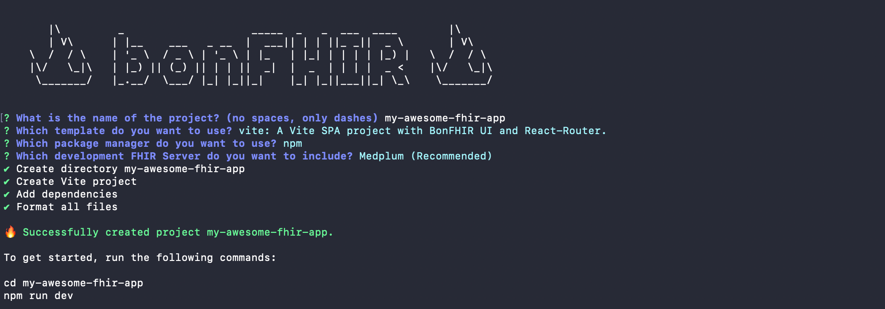

# Create from the Vite template

1. In a terminal, install and run package **@bonfhir/create-bonfhir**

   ```bash
   npm create -y bonfhir@latest
   ```

2. Provide a project name and select the **vite** template with the **Medplum** FHIR server:

   

:::info

This project template create a brand new React application using [Vite](https://vitejs.dev/), and:

- add the required bonFHIR packages with [Mantine integration](https://mantine.dev/)
- update the [TypeScript configuration](/packages/intro#typescript-configuration)
- add the [React Router](https://reactrouter.com/) package and configure it for client-side routing
- add the [`react-oidc-context`](https://github.com/authts/react-oidc-context) package and configure it for authentication
- include a layout and a page to get started

:::
