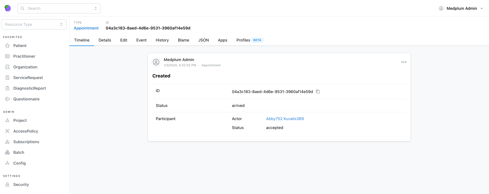
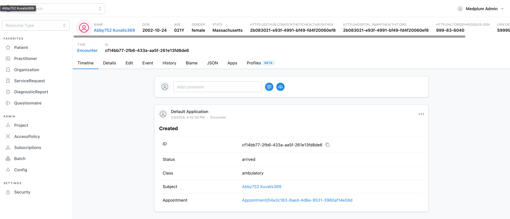

We are now moving to the API side of Next.js.

For this example we'll create a [FHIR Subscription](https://hl7.org/fhir/R4B/subscription.html) that ensure that an
[Encounter](https://hl7.org/fhir/R4B/encounter.html) is created automatically when an [Appointment](https://hl7.org/fhir/R4B/appointment.html)
has its status set to `arrived`.

## The subscription handler

Create a new file `src/subscriptions/arrived-appointments.ts` and paste the following code:

```typescript title="src/subscriptions/arrived-appointments.ts"
import {
  Appointment,
  Practitioner,
  Reference,
  build,
  findReference,
  isReferenceOf,
  reference,
} from "@bonfhir/core/r4b";
import { FhirSubscription } from "@bonfhir/subscriptions/r4b";

export const arrivedAppointments: FhirSubscription<Appointment> = {
  criteria: "Appointment?status=arrived",
  reason: "Create encounters for arrived appointments",
  endpoint: "arrived-appointments",
  async handler({ fhirClient, resource: appointment, logger }) {
    // This is just a precaution
    if (!appointment || appointment.status !== "arrived") return;

    // Check if the appointment already has an encounter associated
    const existingEncounters = await fhirClient.search("Encounter", (search) =>
      search.appointment(appointment),
    );
    if (existingEncounters.searchMatch().length > 0) return;

    // Create the new encounter
    // Note that we're using the build function from @bonfhir/core to create the encounter.
    // We reference the appointment, and copy the appointment's subject and participants as well.
    const newEncounter = build("Encounter", {
      status: "arrived",
      class: {
        system: "http://terminology.hl7.org/CodeSystem/v3-ActCode",
        code: "AMB",
        display: "ambulatory",
      },
      appointment: [reference(appointment)],
      subject: findReference(
        appointment.participant.map((p) => p.actor),
        "Patient",
      ),
      participant: appointment.participant
        .filter((participant) =>
          isReferenceOf(participant.actor, "Practitioner"),
        )
        .map((participant) => ({
          individual: participant.actor as Reference<Practitioner>,
          type: participant.type,
        })),
    });

    const result = await fhirClient.save(newEncounter);

    logger?.info("Created encounter", result);
  },
};
```

Also, we need to update the `src/middleware.ts` file to add the new subscription to the middleware:

```typescript title="src/middleware.ts"
// ...
import { arrivedAppointments } from "./subscriptions/arrived-appointments";

export const middleware = fhirSubscriptions({
  // ...
  subscriptions: [arrivedAppointments],
});
```

## Run the registration

Since we added a new subscription handler, we need to make sure it is registered properly.
Assuming the dev server is still running (if not, run the `npm run dev` command), run the following command in the project directory:

```bash npm2yarn
npm run register-subscriptions
```

You should see the following output in the dev Server process:

```bash
Registering subscriptions...
Subscription Create encounters for arrived appointments for Appointment?status=arrived on http://host.docker.internal:3000/api/fhir/subscriptions/arrived-appointments registered.
```

## Test the subscription

Head over to [Medplum and create a new appointment](http://localhost:8100/Appointment) with the status `arrived`.
You can even include participants!



Then [search for encounters](http://localhost:8100/Encounter) and look at the last one updated - you should see the one
that the subscription just created!



Congratulation! You have now created your first subscription.

Learn more about subscriptions [here](/packages/subscriptions).
