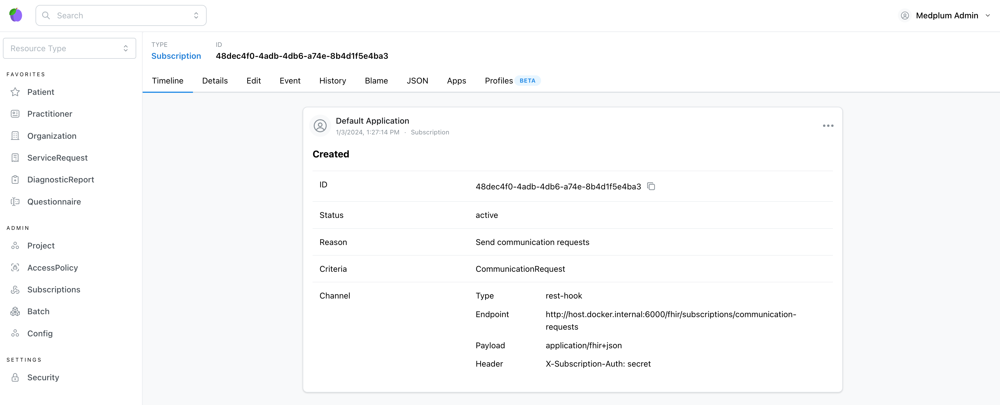

## Run the serverless application locally

In the project directory, run the following command:

```bash npm2yarn
npm run dev
```

This launches the app locally with a web server that simulates API Gateway.

The project uses the [serverless framework](https://www.serverless.com/framework) to develop the AWS Lmabda application,
and comes pre-configured with the [serverless-esbuild](https://www.npmjs.com/package/serverless-esbuild) and [serverless-offline](https://www.npmjs.com/package/serverless-offline)
plugins to respectively build the TypeScript codebase and run it locally.

:::info[Serverless configuration]

The serverless framework is configured using the `serverless.yml` file at the root of the project.

:::

## Register the subscriptions

In another terminal, while the both the [local FHIR Server](/docs/build-a-subscription-api-with-aws-lambda/setup-fhir-server)
and the [AWS Lambda local server](#run-the-serverless-application-locally) are running, run the following command:

```bash npm2yarn
npm run register-subscriptions
```

This is just a shorthand to call [the registration endpoint in the local server](/packages/subscriptions/aws-lambda#invoke-the-registration-of-the-subscriptions).

You should get:

- a successful reponse (`HTTP/1.1 204 No Content`)

```bash
> curl -i --request POST 'http://localhost:6000/fhir/subscriptions/register' --header 'X-Subscription-Auth: secret'

HTTP/1.1 204 No Content
content-type: application/json; charset=utf-8
cache-control: no-cache
vary: accept-encoding
Date: Wed, 03 Jan 2024 18:27:14 GMT
Connection: keep-alive
Keep-Alive: timeout=5
```

- a log in the local AWS Lambda server confirming the registration:

```bash
POST /fhir/subscriptions/register (λ: subscriptions)
Registering subscriptions...
Subscription Send communication requests for CommunicationRequest on http://host.docker.internal:6000/fhir/subscriptions/communication-requests registered.
(λ: subscriptions) RequestId: 266ce46c-66b7-464e-bdf0-3e04795fa3e8  Duration: 141.60 ms  Billed Duration: 142 ms
```

Head over to the local Medplum server and have a look at the subscriptions (http://localhost:8100/Subscription) - you should see the one that just got registered!



## Test the subscription

Next, we'll create a new [CommunicationRequest](https://hl7.org/fhir/R4B/communicationrequest.html) and see if the subscription works properly.

Go to http://localhost:8100/CommunicationRequest, and create a new `CommunicationRequest` resource with an `active` status.

Once saved, you should see in the local AWS Lambda app output the result of the subscription being invoked:

```bash
POST /fhir/subscriptions/communication-requests (λ: subscriptions)
{
  resourceType: 'CommunicationRequest',
  status: 'active',
  id: '8972d7cc-3239-4715-b287-608937af3af4',
  meta: {
    versionId: '7ed0dcae-edcb-4e75-ae19-39ee5eeb45d1',
    lastUpdated: '2024-01-03T19:45:26.158Z',
    author: {
      reference: 'Practitioner/8d676972-5835-483e-b0df-a6c186729af7',
      display: 'Medplum Admin'
    },
    project: 'cd8a377a-ab31-4dc2-8c71-ba18a4888a18',
    compartment: [ [Object] ]
  }
}
(λ: subscriptions) RequestId: 47644d97-731d-407b-b29f-1cf216a10159  Duration: 67.14 ms  Billed Duration: 68 ms
```

Congratulations - the subscription is successful!
