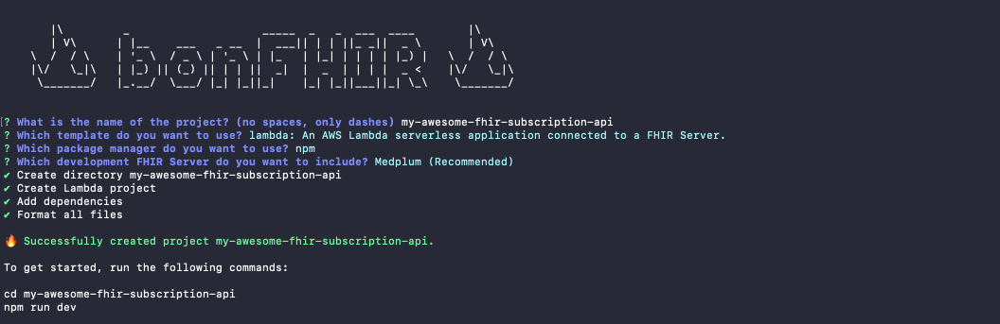

1. In a terminal, run the following command

   ```bash
   npm create -y bonfhir@latest
   ```

2. Provide a project name and select the **lambda** template with the **Medplum** FHIR Server:

   

3. `cd` into the new project and open it in your favorite editor
